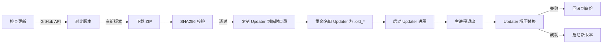
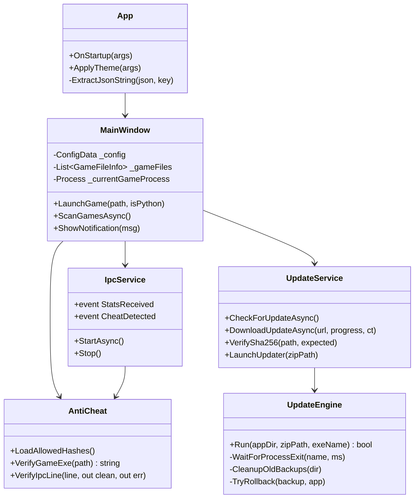

# SnakeLauncherWPF

<div align="center">

**为「自由贪吃蛇」系列打造的现代化游戏启动器**

*Liquid Glass Design · IPC Real-time Sync · Anti-Cheat · Auto-Update*

[](https://www.microsoft.com/windows)
[](https://dotnet.microsoft.com/download/dotnet-framework/net48)
[](https://learn.microsoft.com/dotnet/desktop/wpf/)
[](https://github.com/MMA131845/SnakeLauncherWPF/releases)
[](LICENSE)
[](https://github.com/MMA131845/SnakeLauncherWPF/stargazers)

[功能特性](#-功能特性) · [快速开始](#-快速开始) · [架构设计](#-架构设计) · [技术亮点](#-技术亮点) · [开发路线](#-开发路线) · [配套游戏](#-配套游戏)

</div>

---

## 项目简介

**SnakeLauncherWPF** 是一个使用 **WPF (.NET Framework 4.8)** 从零构建的现代化游戏启动器，为「自由贪吃蛇」系列提供统一的多版本管理、游戏调度、进程守护、依赖自动化与安全校验能力。它通过 **Named Pipe（命名管道）** 与游戏建立低延迟双向通信，将运行时的 FPS、得分、击杀数、游戏模式等状态实时同步到 UI；同时通过 **HMAC-SHA256 消息签名**、**EXE 哈希白名单** 与 **会话合理性追踪** 三层防护构建反作弊体系。

> **设计哲学**：一个启动器应当既是游戏的分发中枢，也是游戏生态的信任根。它需要感知游戏的每一次启动、每一帧数据、每一次异常，并在必要时刻做出正确的决策。

### 项目定位

| 维度 | 描述 |
|:----:|:-----|
| **目标用户** | 贪吃蛇系列玩家、多版本测试人员、开发者 |
| **核心价值** | 统一管理双分支游戏、实时数据同步、安全可信 |
| **技术标签** | WPF · Named Pipe · IPC · 反作弊 · 自更新 · 多语言 |
| **代码规模** | ~9000 行 C# / XAML，2 个独立可执行项目 |

---

## 功能特性

### 游戏管理

<table>
<tr>
<td width="50%">

**多分支统一管理**
- C# WPF 版 / Python 版同时支持
- 自动识别 5 种目录布局规范
- 智能版本号解析（父目录 / 文件名 / EXE 元数据三级回退）
- 同名版本去重，优先保留 EXE 版本
- 右键重命名 / 快速打开所在目录

</td>
<td width="50%">

**多版本智能排序**
- 默认排序：按版本号降序
- 最近游玩：按 `LastPlayed` 时间倒序
- 最常游玩：按 `LaunchCount` 次数倒序
- 「最新版本」突出卡片置顶展示
- 支持手动添加外部游戏文件

</td>
</tr>
</table>

### IPC 实时通信

| 通道 | 方向 | 频率 | 内容 |
|:-----|:----:|:----:|:-----|
| `SnakeGameFPSPipe` | 游戏 → 启动器 | ~500ms | FPS / 得分 / 击杀 / 模式 / 时间戳 |

- **状态栏实时渲染** — FPS、得分、击杀、模式（自动翻译）、时长
- **连接状态灯** — 灰（未连接） / 绿（已连接）双色指示
- **断线自动清理** — 游戏退出后自动停止定时器并隐藏状态栏
- **管道占用恢复** — 三次重试机制解决 "管道正在使用" 冲突

### 反作弊系统

> **三层防护，纵深防御**

```
┌──────────────────────────────────────────────────────┐
│  1 静态完整性  │  EXE 文件 SHA256 白名单校验          │
│                │  → 不匹配 → 阻止启动                  │
├──────────────────────────────────────────────────────┤
│  2 传输安全    │  IPC 消息 HMAC-SHA256 签名            │
│                │  → 密钥不匹配 → 丢弃消息              │
│                │  → 时间戳超过 30s → 视为重放攻击      │
├──────────────────────────────────────────────────────┤
│  3 行为合理    │  会话数据速率检测                     │
│                │  → 分数 > 800/秒 → 告警               │
│                │  → 击杀 > 8/秒   → 告警               │
└──────────────────────────────────────────────────────┘
```

- 白名单哈希存储于 `game_hashes.json`，用户可自行维护
- 反作弊告警不中断游戏，仅弹出通知条提示
- Python 版游戏暂不做 EXE 校验（无独立二进制）

### Python 依赖自动化

- **环境探测** — 调用 `python --version` 探测可用性
- **依赖检测** — `pip show` 精确判断 pygame / pywin32 安装状态
- **一键安装** — 自动升级 pip 后安装缺失包
- **失败引导** — 提供 `pip install {pkg}` 手动命令提示
- **未装 Python** — 引导跳转官方下载页面

### 下载与分发

- **多仓库切换** — SnakeGameWpf / Snake-Game-Python-Edition
- **Release 列表** — 支持 100 条/页，自动过滤 Draft 与 Pre-release
- **版本语义解析** — 从 Asset 文件名正则提取版本号
- **路径前置确认** — 下载前弹窗确认目标路径，可即时更改
- **ZIP 严格校验** — 检测包命名 + 包结构 + 关键依赖文件
- **静默重装** — 游戏文件缺失时询问用户后自动重新下载安装

**C# 包校验规则**：

| 文件 | 必须 | 说明 |
|:-----|:----:|:-----|
| `SnakeGame.exe` / `SnakeGameWpf.exe` | 是 | 主程序外壳 |
| `SnakeGame.dll` / `SnakeGameWpf.dll` | 是 | 真正的代码所在 |
| `Newtonsoft.Json.dll` | 是 | 必需依赖，缺失将崩溃 |
| `SnakeGame.runtimeconfig.json` | 是 | .NET 运行时加载配置 |

### 启动器自更新



- **SHA256 校验** — 从 Release body 的 `<!-- SHA256: ... -->` 注释中提取
- **独立更新进程** — Updater 从临时目录运行，不锁定安装目录
- **原子替换** — 覆盖前备份到 `_backup_yyyyMMdd_HHmmss/`
- **失败回滚** — 任一文件覆盖失败自动从备份恢复

### Liquid Glass UI

<table>
<tr>
<td width="50%">

**视觉设计**
- 无边框窗口 + WindowChrome 原生拖拽缩放
- 三个彩色光斑（蓝 / 粉 / 紫）持续漂移
- 26~28px 圆角玻璃主体 + 阴影层
- 渐变玻璃边框，深浅色主题自动切换

</td>
<td width="50%">

**交互细节**
- Tab 底部滑动指示条（CubicEase 280ms）
- 通知横条弹性滑入（ElasticEase 450ms）
- 详情弹窗缩放进入（BackEase 380ms）
- 所有按钮 Hover / Pressed / Disabled 三态

</td>
</tr>
</table>

### 多语言支持

| 语言 | 代码 | 覆盖率 |
|:-----|:----:|:------:|
| 简体中文 | `zh-CN` | 100% |
| English | `en-US` | 100% |
| Deutsch | `de-DE` | 100% |
| Français | `fr-FR` | 100% |
| Русский | `ru-RU` | 100% |

- **内嵌字典** — 零外部依赖，无需资源文件加载
- **即时切换** — 无需重启，重建顶部栏 + 当前标签页
- **220+ 键值对** — 覆盖所有 UI 文本、对话框、通知、模式名

### 数据统计

- **总览面板** — 累计游玩时长 / 启动次数 / 历史最高分 / 累计击杀
- **继续游戏** — 一键恢复上次运行的游戏
- **各游戏最佳** — 按游戏路径分组，展示最高分 + 击杀 + 总局数
- **最近对局** — 最多显示 15 条会话记录（时间 / 游戏 / 模式 / 时长 / 分数）
- **持久化存储** — `game_stats.json` + `game_history.json`

---

## 快速开始

### 环境要求

| 组件 | 最低版本 | 推荐版本 |
|:-----|:--------:|:--------:|
| Windows | 10 (1809) | 11 22H2+ |
| .NET Framework | 4.8 | 4.8.1 |
| Visual Studio | 2019 | 2022 |
| Python（可选） | 3.8 | 3.11+ |

### 构建

```powershell
# 1. 克隆仓库
git clone https://github.com/MMA131845/SnakeLauncherWPF.git
cd SnakeLauncherWPF

# 2. 还原 NuGet 包
nuget restore SnakeLauncherWPF.sln

# 3. 编译（Release）
msbuild SnakeLauncherWPF.sln /p:Configuration=Release /p:Platform=x64

# 4. 运行
.\SnakeLauncherWPF\bin\Release\SnakeLauncherWPF.exe
```

> 注意：本项目需同步构建 `SnakeLauncherWPF.Updater` 项目，否则自动更新功能不可用。

### 首次配置

```json
{
  "Directories": ["C:\\Games\\SnakeGame"],
  "DownloadPath": "C:\\Downloads\\SnakeGame",
  "ThemeMode": "light",
  "AccentColor": "#0078d4",
  "Language": "zh-CN",
  "AutoCheckUpdate": true,
  "SkipUpdateVersion": ""
}
```

字段说明：

| 字段 | 类型 | 说明 |
|:-----|:-----|:-----|
| `Directories` | `string[]` | 游戏扫描目录列表 |
| `DownloadPath` | `string` | ZIP 下载目录 |
| `ThemeMode` | `"light" \| "dark"` | 主题模式 |
| `AccentColor` | `string` | 强调色，支持任意 HEX |
| `Language` | `string` | 语言代码，见多语言表 |
| `AutoCheckUpdate` | `bool` | 自动检查更新 |
| `SkipUpdateVersion` | `string` | 已跳过的版本号 |

---

## 架构设计

### 模块分层

```
┌─────────────────────────────────────────────────────────────────┐
│                        Presentation Layer                        │
│  ┌────────────────┐  ┌────────────────┐  ┌────────────────┐    │
│  │  MainWindow    │  │  SplashWindow  │  │  Updater.Window│    │
│  │  (5 个页面)    │  │  (3s 展示)     │  │  (进度 + 错误) │    │
│  └────────────────┘  └────────────────┘  └────────────────┘    │
├─────────────────────────────────────────────────────────────────┤
│                       Application Layer                          │
│  ┌────────────┐  ┌────────────┐  ┌────────────┐  ┌──────────┐  │
│  │ ThemeMgr   │  │  Lang      │  │  IpcSvc    │  │  Config  │  │
│  └────────────┘  └────────────┘  └────────────┘  └──────────┘  │
├─────────────────────────────────────────────────────────────────┤
│                         Domain Layer                             │
│  ┌────────────┐  ┌────────────┐  ┌────────────┐  ┌──────────┐  │
│  │ GameStats  │  │ AntiCheat  │  │ UpdateEngine│  │ Download │  │
│  │  Manager   │  │            │  │             │  │  Mgr     │  │
│  └────────────┘  └────────────┘  └────────────┘  └──────────┘  │
├─────────────────────────────────────────────────────────────────┤
│                    Infrastructure Layer                          │
│  ┌──────────────┐  ┌──────────────┐  ┌────────────────────┐    │
│  │ GitHub API   │  │  Named Pipe  │  │ PythonDependency   │    │
│  │ Service      │  │  Server      │  │  Manager           │    │
│  └──────────────┘  └──────────────┘  └────────────────────┘    │
└─────────────────────────────────────────────────────────────────┘
```

### 核心类图（节选）



### 目录结构

```
SnakeLauncherWPF/
│
├── SnakeLauncherWPF/                      主程序项目
│   ├── App.xaml(.cs)                      应用入口 · 全局异常 · 启动流程
│   ├── MainWindow.xaml(.cs)               主窗口 · 5 页面 · 游戏进程管理
│   ├── SplashWindow.xaml(.cs)             启动画面（3 秒展示）
│   ├── Lang.cs                            多语言资源（220+ 键 × 5 语言）
│   ├── IpcService.cs                      Named Pipe 服务器 + 反作弊集成
│   ├── AntiCheat.cs                       HMAC 校验 + 会话合理性追踪
│   ├── PythonDependencyManager.cs         Python 环境 / 依赖自动管理
│   ├── GitHubReleaseService.cs            GitHub Releases 多仓库拉取
│   ├── UpdateService.cs                   启动器自更新编排
│   ├── Properties/
│   │   ├── AssemblyInfo.cs
│   │   ├── Resources.resx                 内嵌资源（含作者头像）
│   │   └── Resources.Designer.cs
│   └── Resources/                         内嵌游戏包 ZIP（历史版本）
│
├── SnakeLauncherWPF.Updater/              独立更新程序（进程隔离）
│   ├── App.xaml(.cs)                      主题跟随主程序参数
│   ├── MainWindow.xaml(.cs)               进度 UI · 重试 · 关闭
│   ├── UpdateEngine.cs                    核心更新引擎（含回滚）
│   └── Program.cs                         传统入口（备用）
│
├── packages.config                        NuGet 依赖清单
├── App.config                             .NET 4.8 运行时配置
└── SnakeLauncherWPF.sln                   Visual Studio 解决方案
```

---

## 技术亮点

### 1. 无边框玻璃窗口 + 光斑漂移动画

```xml
<!-- MainWindow.xaml -->
<Window WindowStyle="None" AllowsTransparency="True" Background="Transparent">
    <shell:WindowChrome.WindowChrome>
        <shell:WindowChrome CaptionHeight="0" ResizeBorderThickness="5"/>
    </shell:WindowChrome.WindowChrome>
    <!-- 三个彩色光斑，各自持有 TranslateTransform 做随机漂移 -->
    <Ellipse x:Name="BgBlob1" Fill="#5C7EC0FF">
        <Ellipse.Effect><BlurEffect Radius="160"/></Ellipse.Effect>
        <Ellipse.RenderTransform><TranslateTransform x:Name="BgBlob1Transform"/></Ellipse.RenderTransform>
    </Ellipse>
</Window>
```

```csharp
// 无限循环：每次生成随机目标，SineEase 缓动，动画结束后递归调用自身
private void AnimateBlobLoop(TranslateTransform t, double minSec, double maxSec, double range)
{
    double targetX = (_blobRandom.NextDouble() - 0.5) * 2 * range;
    double targetY = (_blobRandom.NextDouble() - 0.5) * 2 * range;
    var duration = TimeSpan.FromSeconds(minSec + _blobRandom.NextDouble() * (maxSec - minSec));

    var animX = new DoubleAnimation(t.X, targetX, duration)
    {
        EasingFunction = new SineEase { EasingMode = EasingMode.EaseInOut }
    };
    animX.Completed += (s, e) => AnimateBlobLoop(t, minSec, maxSec, range);
    t.BeginAnimation(TranslateTransform.XProperty, animX);
}
```

### 2. 强调色自动前景色计算

```csharp
// 使用 BT.601 亮度公式计算感知亮度
double luminance = (0.299 * accent.R + 0.587 * accent.G + 0.114 * accent.B) / 255.0;
resources["AccentForegroundBrush"] = new SolidColorBrush(
    luminance > 0.6 ? Colors.Black : Colors.White);
```

配合 `AdjustBrightness()` 生成 hover / pressed 态的强调色，无需硬编码：

```csharp
private static Color AdjustBrightness(Color c, double factor)
{
    byte r = (byte)Math.Min(255, Math.Max(0, c.R * factor));
    byte g = (byte)Math.Min(255, Math.Max(0, c.G * factor));
    byte b = (byte)Math.Min(255, Math.Max(0, c.B * factor));
    return Color.FromRgb(r, g, b);
}
```

### 3. IPC 消息签名与防重放

```csharp
// 消息格式: FPS:60,SCORE:1200,KILLS:15,MODE:classic,TS:1735689600,SIG:a3f1b2...
public static bool VerifyIpcLine(string line, out string cleanPayload, out string errorReason)
{
    // 1 拆分签名
    int sigIdx = line.LastIndexOf(",SIG:", StringComparison.OrdinalIgnoreCase);
    if (sigIdx < 0) { errorReason = "缺少签名"; return false; }

    string payload = line.Substring(0, sigIdx);
    string providedSig = line.Substring(sigIdx + 5).Trim();

    // 2 拆分时间戳
    int tsIdx = payload.LastIndexOf(",TS:", StringComparison.OrdinalIgnoreCase);
    if (tsIdx < 0) { errorReason = "缺少时间戳"; return false; }

    long ts = long.Parse(payload.Substring(tsIdx + 4));
    long now = DateTimeOffset.UtcNow.ToUnixTimeSeconds();

    // 3 时间戳容忍窗口（30 秒）
    if (Math.Abs(now - ts) > 30) { errorReason = "时间戳过期（可能重放）"; return false; }

    // 4 HMAC-SHA256 校验
    string expectedSig = ComputeHmac(payload);
    if (!string.Equals(expectedSig, providedSig, StringComparison.OrdinalIgnoreCase))
    { errorReason = "签名不匹配"; return false; }

    cleanPayload = payload.Substring(0, tsIdx);
    return true;
}
```

> 密钥 `RootKey` 硬编码于游戏端与启动器端，必须完全一致；消息体采用 `,` 分隔 `KEY:VALUE` 的极简格式，避免 JSON 序列化开销。

### 4. 会话数据合理性检测

```csharp
public void Feed(long ts, int score, int kills)
{
    if (_lastTs > 0 && ts > _lastTs)
    {
        double dt = ts - _lastTs;
        double scoreRate = (score - _lastScore) / dt;
        double killRate  = (kills - _lastKills) / dt;

        if (scoreRate > 800.0) { IsSuspicious = true; SuspiciousReason = $"分数增速异常 ({scoreRate:F0}/秒)"; }
        else if (killRate > 8.0) { IsSuspicious = true; SuspiciousReason = $"击杀增速异常 ({killRate:F1}/秒)"; }
    }
    _lastTs = ts; _lastScore = score; _lastKills = kills;
}
```

阈值依据：正常游戏帧率约 60 FPS，得分增长速率不超过 200/秒；800/秒留足 4 倍冗余以容忍低帧率下的批处理上报。

### 5. 配置原子写入（防损坏）

```csharp
// 写入临时文件 → 替换（或移动）→ 失败重试 5 次
using (var fs = new FileStream(tempPath, FileMode.Create, FileAccess.Write,
        FileShare.Read, 4096, FileOptions.WriteThrough))
using (var sw = new StreamWriter(fs, new UTF8Encoding(false)))
{
    sw.Write(json);
    sw.Flush();
    fs.Flush(true);  // 强制刷盘
}

for (int i = 0; i < 5; i++)
{
    try
    {
        if (File.Exists(ConfigPath))
            File.Replace(tempPath, ConfigPath, null, ignoreMetadataErrors: true);
        else
            File.Move(tempPath, ConfigPath);
        return;
    }
    catch (IOException) { Thread.Sleep(50 * (i + 1)); }  // 指数退避
}
```

### 6. 独立更新进程 + 自锁定规避

**问题**：Updater 若从安装目录运行，自身会被锁定，无法被新版替换。

**方案**：主程序启动前，将 Updater 复制到临时目录，并重命名安装目录中的旧版本：

```csharp
// 1 复制 Updater 到临时目录
string updaterTempPath = Path.Combine(tempDir, UpdaterExeName);
File.Copy(updaterPathInApp, updaterTempPath, overwrite: true);

// 2 复制所有 DLL 依赖（保证临时目录可独立运行）
foreach (var dll in Directory.GetFiles(appDir, "*.dll"))
    File.Copy(dll, Path.Combine(tempDir, Path.GetFileName(dll)), overwrite: true);

// 3 重命名安装目录中的旧 Updater
File.Move(updaterPathInApp, updaterPathInApp + ".old_" + DateTime.Now.ToString("yyyyMMddHHmmss"));

// 4 从临时目录启动
Process.Start(new ProcessStartInfo {
    FileName = updaterTempPath,
    Arguments = $"--app-dir \"{appDir}\" --zip \"{zipPath}\" --exe \"{currentExeName}\" ...",
    WorkingDirectory = tempDir,
    UseShellExecute = true
});

Environment.Exit(0);  // 主进程立即退出，释放文件锁
```

### 7. 智能版本扫描（5 种布局）

```
1 <baseDir>/<版本目录>/dist/贪吃蛇.exe         (C# 打包格式)
2 <baseDir>/SnakeGame.exe                     (扁平 C# 部署)
3 <baseDir>/**/*贪吃蛇(x.y.z).py               (Python 脚本)
4 <baseDir>/**/SnakeGameWpf.exe               (C# 新版名)
5 <baseDir>/<版本目录>/SnakeGame.exe          (版本目录 C#)
```

版本号来源优先级：**父目录名匹配** → **EXE 文件版本信息** → **文件名正则**。

### 8. 智能删除（多重安全检查）

```csharp
// 1 拒绝磁盘根目录
if (string.Equals(parentDir, Path.GetPathRoot(gamePath))) return "拒绝";

// 2 拒绝启动器自身目录
if (string.Equals(parentDir.TrimEnd('\\'), AppDomain.CurrentDomain.BaseDirectory.TrimEnd('\\'))) 
    return "拒绝";

// 3 判断父目录是否还有其他游戏（.exe/.py/子目录）
bool hasOtherGames = ...;

// 4 有 → 只删单文件；无 → 删整个目录
```

### 9. 多语言内嵌字典

```csharp
// 切换语言：替换字典 → 触发事件 → 主窗口重建当前标签页
public static void SetLanguage(string lang)
{
    if (_current == lang && _dict != null) return;
    _current = lang;
    LoadLanguage(lang);
    LanguageChanged?.Invoke();
}

// 使用方式：Lang.T("Launch.StartGame") → "启动游戏" / "Start Game" / ...
public static string T(string key)
{
    if (_dict != null && _dict.TryGetValue(key, out var v) && v != null) return v;
    return key;  // 未命中则返回键名，便于发现遗漏
}
```

### 10. 严格 ZIP 结构校验

```csharp
// 遍历 ZIP 根目录文件，判定是否为合法游戏包
foreach (var entry in archive.Entries)
{
    if (entry.FullName.Contains("/")) continue;  // 只看根目录
    string lower = entry.Name.ToLowerInvariant();

    if (lower == "snakegame.exe" || lower == "snakegamewpf.exe") hasExe = true;
    if (lower == "newtonsoft.json.dll") hasNewtonsoftJson = true;
    if (lower == "snakegame.dll" || lower == "snakegamewpf.dll") hasGameDll = true;
    if (lower == "snakegame.runtimeconfig.json") hasRuntimeConfig = true;
    if (lower.EndsWith(".py")) hasPy = true;
}

// C# 包必须 4 项齐全，缺一即拒绝
if (hasExe && !hasNewtonsoftJson) return (false, "缺少依赖库 Newtonsoft.Json.dll...", ...);
if (hasExe && !hasGameDll)        return (false, "缺少主程序集 SnakeGame.dll...", ...);
if (hasExe && !hasRuntimeConfig)  return (false, "缺少 SnakeGame.runtimeconfig.json...", ...);
```

---

## 技术栈

<table>
<tr>
<td align="center" width="20%">
<br/>
<b>C# 9.0</b><br/>
<sub>LangVersion 7.3 兼容</sub>
</td>
<td align="center" width="20%">
<br/>
<b>.NET 4.8</b><br/>
<sub>Framework</sub>
</td>
<td align="center" width="20%">
<br/>
<b>WPF</b><br/>
<sub>UI 框架</sub>
</td>
<td align="center" width="20%">
<br/>
<b>Python 3.8+</b><br/>
<sub>可选运行时</sub>
</td>
<td align="center" width="20%">
<br/>
<b>GitHub API</b><br/>
<sub>分发 & 更新</sub>
</td>
</tr>
</table>

**核心 NuGet 依赖**：

| 包名 | 版本 | 用途 |
|:-----|:----:|:-----|
| `System.Text.Json` | 10.0.8 | 高性能 JSON 序列化 |
| `System.IO.Pipelines` | 10.0.8 | 管道 IO 优化 |
| `Microsoft.Bcl.AsyncInterfaces` | 10.0.8 | 异步接口回填 |
| `System.Memory` | 4.6.3 | Span/Memory 支持 |
| `System.ValueTuple` | 4.6.2 | 元组语法支持 |

---

## 开发路线

### 已完成

- [x] 双分支游戏管理（C# / Python）
- [x] Liquid Glass 无边框 UI
- [x] Named Pipe IPC 实时通信
- [x] 反作弊系统（HMAC + 哈希 + 速率）
- [x] Python 依赖自动检测与安装
- [x] 启动器自更新（含回滚）
- [x] 多语言支持（5 种语言）
- [x] 数据统计与历史记录
- [x] 从 GitHub Releases 下载安装
- [x] 智能版本扫描与去重

### 规划中

- [ ] **成就系统** — 全局成就解锁、跨游戏统计
- [ ] **游戏内嵌商店** — 皮肤 / 地图 / 音效包分发
- [ ] - [ ] **AI 反作弊升级** — 基于行为序列的异常检测

### 想法池

- [ ] 游戏录制与回放
- [ ] 性能面板（GPU / CPU 占用）

---

## 配套游戏

<table>
<tr>
<td align="center">
<a href="https://github.com/MMA131845/SnakeGameWpf">

</a>
<br/><br/>
<b>自由贪吃蛇 C# 版</b><br/>
<sub>WPF (.NET 10) · 五种模式 · 局域网联机</sub>
</td>
</tr>
</table>

游戏通过 `SnakeGameFPSPipe` 向启动器上报状态：

```
FPS:60,SCORE:1200,KILLS:15,MODE:classic,TS:1735689600,SIG:a3f1b2c8...
```

**五种游戏模式**：

| 模式 | Key | 描述 |
|:-----|:----|:-----|
| 经典模式 | `classic` | 传统贪吃蛇玩法 |
| 淘汰之王 | `timed` | 限时淘汰赛 |
| 占领模式 | `team4v4` | 4v4 占点 |
| 极限模式 | `extreme` | 高难度挑战 |
| 搜打撤 | `extraction` | PvPvE 撤离玩法 |

---

## 常见问题

<details>
<summary><b>Q1: 启动器提示「版本不兼容」怎么办？</b></summary>

启动器只支持特定版本范围的 IPC 通信：
- Python：`2.2.0 ~ 2.4.0` 或 `2.15.4 ~ 3.0.5`
- C#：任意版本

若版本不匹配，游戏仍可启动，但**底部状态栏 / 数据统计 / 反作弊**将失效。建议从「下载」页安装兼容版本。
</details>

<details>
<summary><b>Q2: Python 版游戏启动报错「ModuleNotFoundError」？</b></summary>

这表示依赖未安装。启动器在下载 Python 包后会自动检测并提示安装 `pygame` 和 `pywin32`。若已跳过，可在「设置 → 游戏目录」重新下载，或手动运行：

```bash
pip install pygame pywin32
```
</details>

<details>
<summary><b>Q3: 反作弊误报怎么办？</b></summary>

两种情况：

1. **EXE 哈希不匹配** — 你可能修改了游戏 EXE。若为自己使用，编辑安装目录下的 `game_hashes.json`，将你的 EXE 哈希写入即可。
2. **IPC 签名失败** — 说明游戏端与启动器端密钥不一致，通常出现在混用不同版本的场合。请从官方渠道重新下载。

计算文件哈希：

```powershell
Get-FileHash .\SnakeGame.exe -Algorithm SHA256
```
</details>

<details>
<summary><b>Q4: 更新时提示「Updater.exe 不存在」？</b></summary>

发布包必须同时包含主程序和 Updater。若从源码编译，请确保同时构建 `SnakeLauncherWPF.Updater` 项目，并将其输出复制到主程序目录。
</details>

<details>
<summary><b>Q5: 主题切换后启动画面颜色没变？</b></summary>

启动画面（SplashWindow）由 `App.xaml.cs` 在 `OnStartup` 阶段创建，此时主题尚未完全应用。启动器会在切换主题后自动重启，重启后即可生效。
</details>

<details>
<summary><b>Q6: 如何贡献新语言？</b></summary>

在 `Lang.cs` 中新增一个 `Dictionary<string, string>`（如 `JaJp`），然后在 `LoadLanguage` 的 `switch` 中注册。所有键必须与 `ZhCn` 一致。
</details>

---

## 贡献指南

我们欢迎任何形式的贡献！

```bash
# 1. Fork 本仓库
# 2. 创建特性分支
git checkout -b feature/amazing-feature

# 3. 提交更改（遵循 Conventional Commits）
git commit -m "feat(ipc): add reconnect backoff strategy"

# 4. 推送并创建 Pull Request
git push origin feature/amazing-feature
```

**代码规范**：
- C# 遵循 [Microsoft C# Coding Conventions](https://learn.microsoft.com/dotnet/csharp/fundamentals/coding-style/coding-conventions)
- XAML 命名使用 PascalCase
- 提交信息遵循 [Conventional Commits](https://www.conventionalcommits.org/)

**提交类型**：`feat` · `fix` · `docs` · `style` · `refactor` · `perf` · `test` · `chore`

---

## 开源协议

本项目基于 **MIT License** 开源，详见 [LICENSE](LICENSE)。

```
MIT License

Copyright (c) 2026 MEIMAOA

Permission is hereby granted, free of charge, to any person obtaining a copy
of this software and associated documentation files (the "Software"), to deal
in the Software without restriction, including without limitation the rights
to use, copy, modify, merge, publish, distribute, sublicense, and/or sell
copies of the Software, and to permit persons to whom the Software is
furnished to do so, subject to the following conditions:

The above copyright notice and this permission notice shall be included in all
copies or substantial portions of the Software.
```

---

## 致谢

<table>
<tr>
<td align="center" width="25%">
<b>开发</b><br/>
<sub>没冇啊</sub>
</td>
<td align="center" width="25%">
<b>AI 协助</b><br/>
<sub>ChatGPT · Gemini<br/>Codex · DeepSeek</sub>
</td>
<td align="center" width="25%">
<b>美术设计</b><br/>
<sub>没冇啊</sub>
</td>
<td align="center" width="25%">
<b>QA 测试</b><br/>
<sub>没冇啊</sub>
</td>
</tr>
</table>

**特别感谢**：
- [.NET Community](https://dotnet.microsoft.com/) 提供的优秀开发平台
- [GitHub](https://github.com/) 提供的免费 CI/CD 与分发能力
- 所有为这个项目点 Star、提 Issue、发 PR 的玩家与开发者

---

<div align="center">

### 如果这个项目对你有帮助，请点一个 Star

Made with love by **MEIMAOA**

*"Snake never dies, it just eats itself."*

[回到顶部](#snakelauncherwpf)

</div>
